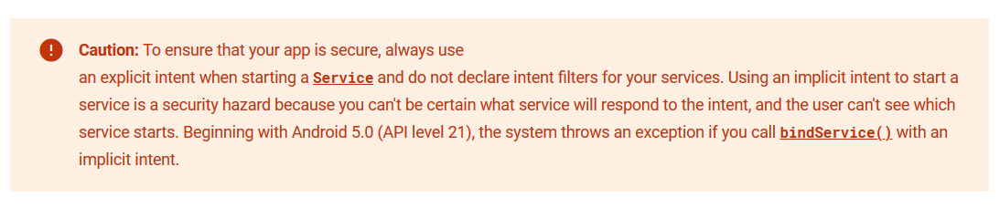
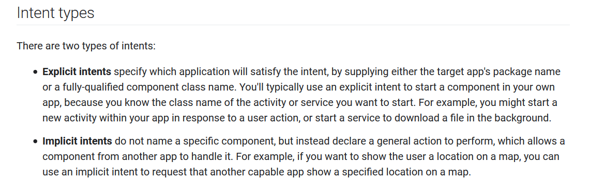
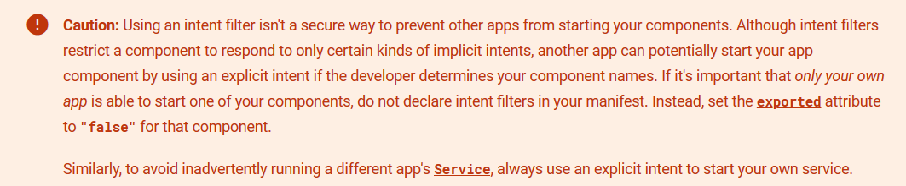
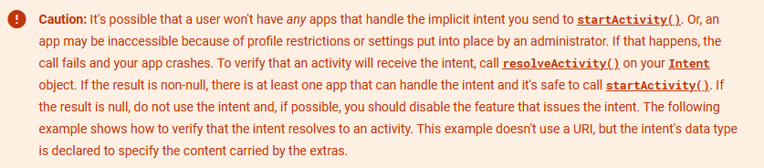
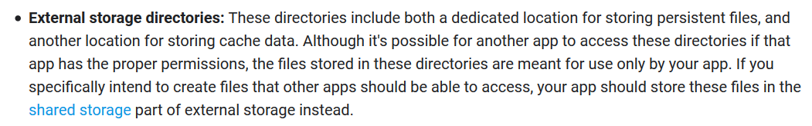

# Components

1. Activities `<activity>`
2. Services `<service>`
3. Broadcast Receivers `<receiver>`
4. Content Providers `<provider>`

Activities, Services and Receivers are *exported* if:

* exported="true"
* intent-filter *and not* exported="false" (*implicitly exported*)

You can not invoke them if:

* exported="false"
* *not* intent-filter *and not* exported="true"

Regarding Content Providers:

* Exported by default on API Level < 17.
* exported="false" by default on API Level > 17.

In addition to being exported, components can add **permissions requirements** needed in order to interact with them.

# Permissions

## To access system features

An App must publicize the permissions it requires by including <uses-permission> tags in the App manifest and then  requesting that the user approve each permission at runtime (on Android 6.0  and higher). For example, an App that needs to send SMS messages would have this line in the manifest: 

```xml
<uses-permission android:name="android.permission.SEND_SMS"/>
```

If your App lists [*normal* permissions](https://developer.android.com/guide/topics/manifest/permission-element.html#plevel) in its manifest (that is,  permissions that don't pose much risk to the user's privacy or the device's  operation), the system automatically grants those permissions to your App.

If your App lists *dangerous* permissions in its manifest (that is,  permissions that could potentially affect the user's privacy or the device's  normal operation), such as the  `SEND_SMS` permission above,  the user must explicitly agree to grant those permissions. Beginning with Android 6.0 (API level 23), users can  revoke permissions from any app at any time, even if the app targets a lower  API level. So even if the app used the camera yesterday, it can't assume it  still has that permission today.

For more information about normal and dangerous permissions,  see [Protection levels](https://developer.android.com/guide/topics/permissions/overview#normal-dangerous).

```java
if (ContextCompat.checkSelfPermission(thisActivity, Manifest.permission.WRITE_CALENDAR)
        != PackageManager.PERMISSION_GRANTED) {
    // Permission is not granted
}
```

When your App receives `PERMISSION_DENIED` from `checkSelfPermission()`, you need to prompt the user for that permission. Android provides several methods you can use to request a permission, such as `requestPermissions()`, as shown in the code snippet below. Calling these methods brings up a standard Android dialog, which you cannot customize.

## Permissions for optional hardware features

Access to some hardware features (such as Bluetooth or the camera) require an App permission. However, not all Android devices actually have these hardware features. So if your App requests the CAMERA permission, it's important that you also include the <uses-feature> tag in your manifest to declare whether or not this feature is actually required. For example:

```xml
<uses-feature android:name="android.hardware.camera" android:required="false" />
```

If you declare `android:required="false"` for the feature, then Google Play allows your App to be installed on devices that don't have the feature. You then must check if the current device has the feature at runtime by calling `PackageManager.hasSystemFeature()`, and gracefully disable that feature if it's not available.

If you don't provide the <uses-feature> tag, then when Google Play sees that your App requests the corresponding permission, it assumes your App requires this feature. So it filters your App from devices without the feature, as if you declared `android:required="true"` in the `<uses-feature>` tag.

## To protect your own components

Permissions aren't only for requesting system functionality. Services  provided by Apps can enforce custom permissions to restrict who can use them.

```xml
<manifest
  xmlns:android="http://schemas.android.com/apk/res/android"
  package="com.example.myapp" >
    
    <permission
      android:name="com.example.myapp.permission.DEADLY_ACTIVITY"
      android:label="@string/permlab_deadlyActivity"
      android:description="@string/permdesc_deadlyActivity"
      android:permissionGroup="android.permission-group.COST_MONEY"
      android:protectionLevel="dangerous" />
    ...
</manifest>
```

### Activities

Permissions applied using the `android:permission` attribute to  the `<activity>` tag in the manifest restrict who can start  that `Activity`. The permission is checked during  `Context.startActivity()` and  `Activity.startActivityForResult()`.  If the caller doesn't have the required permission then  `SecurityException` is thrown from the call.

### Services

Permissions applied using the `android:permission` attribute to the `<service>` tag in the manifest restrict who can start or bind to the associated Service. The permission is checked during `Context.startService()`, `Context.stopService()` and `Context.bindService()`. If the caller doesn't have the required permission then `SecurityException` is thrown from the call. 

### Broadcast receivers

Permissions applied using the `android:permission` attribute to  the `<receiver>` tag restrict who can send broadcasts to the  associated `BroadcastReceiver`. The permission is  checked *after* `Context.sendBroadcast()` returns, as the system tries to deliver the  submitted broadcast to the given receiver. As a result, a permission failure  doesn't result in an exception being thrown back to the caller; it just  doesn't deliver the `Intent`. 

In the same way, a permission can be supplied to `Context.registerReceiver()` to control who can broadcast to a  programmatically registered receiver. Going the other way, a permission can  be supplied when calling `Context.sendBroadcast()` to restrict which broadcast receivers  are allowed to receive the broadcast.

### Content providers

Permissions applied using the `android:permission` attribute to  the `<provider>` tag restrict who can access the data in a  `ContentProvider`. (Content providers have an important  additional security facility available to them called  [URI permissions](https://developer.android.com/guide/topics/permissions/overview#uri) which is described next.)  Unlike the other components, there are two separate permission attributes you  can set: [   `android:readPermission`](https://developer.android.com/guide/topics/manifest/provider-element.html#rprmsn)  restricts who can read from the provider, and  [   `android:writePermission`](https://developer.android.com/guide/topics/manifest/provider-element.html#wprmsn) restricts  who can write to it. Note that if a provider is protected with both a read  and write permission, holding only the write permission doesn't mean  you can read from a provider.

The permissions are checked when you first retrieve a provider (if you  don't have either permission, a `SecurityException`  is thrown), and as you perform operations on the provider. Using  `ContentResolver.query()` requires  holding the read permission; using  `ContentResolver.insert()`,  `ContentResolver.update()`,  `ContentResolver.delete()`  requires the write permission. In all of these cases, not holding the  required permission results in a `SecurityException` being  thrown from the call.

### Security considerations

Do not leak permission-protected data. This occurs when your App exposes data over IPC that is available only because your App has permission to access that data. The clients of your App's IPC interface may not have that same data-access permission.

Generally, you should strive to define as few permissions as possible while satisfying your security requirements. Creating a new permission is relatively uncommon for most Applications, because the [system-defined permissions](https://developer.android.com/reference/android/Manifest.permission.html) cover many situations. Where Appropriate, perform access checks using existing permissions.

If you must create a new permission, consider whether you can accomplish your task with a [signature protection level](https://developer.android.com/guide/topics/manifest/permission-element.html#plevel). Signature permissions are transparent to the user and allow access only by Applications signed by the same developer as the Application performing the permission check. If the new permission is still required, it's declared in the App manifest using the `<uses-permission>`. 

## References

* https://developer.android.com/guide/topics/permissions/overview#permission_enforcement

* https://developer.android.com/training/permissions/requesting

* https://developer.android.com/training/articles/security-tips#Permissions

* Permissions dangerous levels - https://developer.android.com/guide/components/activities/intro-activities.html#dp
* Defining a custom permission - https://developer.android.com/guide/topics/permissions/defining.html

# Activities

* All activities are declared on the **Manifest**.


## Activity declaration

```xml
<activity android:name=".ExampleActivity" android:icon="@drawable/App_icon">
    <intent-filter>
        <action android:name="android.intent.action.SEND" />
        <category android:name="android.intent.category.DEFAULT" />
        <data android:mimeType="text/plain" />
    </intent-filter>
</activity>
```

## Invoking the activity with an implicit intent

```java
// Create the text message with a string
Intent sendIntent = new Intent();
sendIntent.setAction(Intent.ACTION_SEND);
sendIntent.setType("text/plain");
sendIntent.putExtra(Intent.EXTRA_TEXT, textMessage);
// Start the activity
startActivity(sendIntent);
```

## Security considerations

### You start an activity

* Always use **explicit intents for your own components.**
* Be careful with **implicit intents** and **do not put sensitive** data on them.

**Relevant methods**

`startActivity()`

### Your activity is started

* Exported activities can be started by other Apps on the device which may break user
  workflow assumptions, including ways that break security boundaries.
* The activity **do not validate** **the data from the intent**  and performs some sensitive action with it.

**Relevant methods**

`getIntent()`

`intent.getExtra()`

# Services

A *service* is a general-purpose entry point for keeping an App running in the background for all kinds of reasons. 

There are actually **two very distinct semantics services** tell the system about how to manage an App:

- Started services tell the system to keep them running until their work is completed.
- **Bound services** run because some other App (or the system) has said that it wants to make use of the service.  This is basically the service providing an API to another process.  The system thus knows there is a dependency between these processes, so if process A is bound to a service in process B, it knows that it needs to keep process B (and its service) running for A.

## Security Recommendations



### You start a service

* Always use an **explicit intent**.

**Relevant methods**

`bindService()`

`startService()`

### Your service is started

* Do not declare **intent filters** for your services. 
* Declare your services with `exported="false"`.

# Broadcast Receivers

* Can be declared on the Manifest `<receiver>`
* Programmatically with `registerReceiver()`

## Local broadcast

-  You know that the data you are broadcasting won't leave your App, so don't need to worry about leaking private data. 
-  It is not possible for other Applications to send these broadcasts to your App, so you don't need to worry about having security holes they can exploit. 
-  It is more efficient than sending a global broadcast through the system. 

# Sending a broadcast

`sendBroadcast`

`sendOrderedBroadcast`

`LocalBroadcastManager.sendBroadcast`

# Content Providers

* **Content Providers** implements the backend that provides the data.

* Declared on the Manifest `<provider>`

* Implements `import android.content.ContentProvider;`

  `extends ContentProvider `

## Permissions

A provider's application can specify permissions that other applications must have in order to    access the provider's data. These permissions ensure that the user knows what data    an application will try to access. Based on the provider's requirements, other applications    request the permissions they need in order to access the provider. End users see the requested  permissions when they install the application.

**If a provider's application doesn't specify any permissions, then other applications have no  access to the provider's data.** However, components in the provider's application always have full read and write access, regardless of the specified permissions.

All applications can read from or write to your provider, even if the underlying data is private, because by default your provider does not have permissions set. To change this, set permissions for your provider in your manifest file, using attributes or child elements of the `<provider>` element.  **(API LEVEL < 17)**

## Security Recommendations

* Use **parametrized queries.**
* Be careful with **path traversal** in functions like *openFile*.

## References

* https://developer.android.com/guide/topics/manifest/provider-element
* https://github.com/aosp-mirror/platform_frameworks_base/tree/6bebb8418ceecf44d2af40033870f3aabacfe36e/core/java/android/provider
* https://developer.android.com/guide/topics/providers/content-provider-basics#Permissions
* https://developer.android.com/guide/topics/providers/content-provider-creating#implementing-permissions

# Content Resolvers

* **Content Resolvers** implements clients that consume **Content Providers**.
* App uses **content resolvers** to do queries.

- How to **spot** the use of a **content resolver** to query data.

  `getContentResolver();`

- How to spot **content resolver implementations**.

  `import android.content.ContentResolver;`

  `import android.provider.`

  `extends ContentResolver`

  `Cursor query(`

## References

* https://github.com/aosp-mirror/platform_frameworks_base/tree/6bebb8418ceecf44d2af40033870f3aabacfe36e/core/java/android/content

# Intents

**Intents** are used to invoke *activities*, *services* and *send broadcasts* to another App. 



## Explicit

```java
Intent downloadIntent = new Intent(this, DownloadService.class);
downloadIntent.setData(Uri.parse(fileUrl));
startService(downloadIntent);
```

> **Note:** An explicit intent is always delivered to its target, regardless of any intent filters the component declares.

> Using an intent filter isn't a secure way to prevent other Apps from starting your components. Although intent filters restrict a component to respond to only certain kinds of implicit intents, another App can potentially start your App component by using an explicit intent if the developer determines your component names. If it's important that *only your own App* is able to start one of your components, do not declare intent filters in your manifest. Instead, set the [`exported`](https://developer.android.com/guide/topics/manifest/activity-element.html#exported) attribute to `"false"` for that component.

## Implicit

An implicit intent specifies an action that can invoke any App on the device able to perform the action. 

```java
// Create the text message with a string
Intent sendIntent = new Intent();
sendIntent.setAction(Intent.ACTION_SEND);
sendIntent.putExtra(Intent.EXTRA_TEXT, textMessage);
sendIntent.setType("text/plain");

// Verify that the intent will resolve to an activity
if (sendIntent.resolveActivity(getPackageManager()) != null) {
    startActivity(sendIntent);
}
```





## Intent arguments
https://developer.android.com/studio/command-line/adb#IntentSpec

### Data
### Actions
### Category
### Type

# Defining intent-filters

Each App can define **intent-filters** for its *activities*, *services*, *broadcast receivers*.

## Manifest

## Programmatically

## References

* Intents filters - https://developer.android.com/guide/components/intents-filters
* https://developer.android.com/guide/components/intents-filters#Receiving
* Intents common - https://developer.android.com/guide/components/intents-common
* Android intent hijacking - https://attack.mitre.org/techniques/T1416/

# Media Store

`MediaStore`

## References

* https://developer.android.com/reference/android/provider/MediaStore.html

# External Storage

```
https://developer.android.com/training/articles/security-tips#ExternalStorage
```

# SD card



**So, any App with READ|WRITE_EXTERNAL_STORAGE can tamper with data stored on the sd card. Data in shared storage can be accessed by any App without special permissions.**

# Shared storage

## References

* https://developer.android.com/training/data-storage

* https://developer.android.com/training/data-storage/shared/documents-files