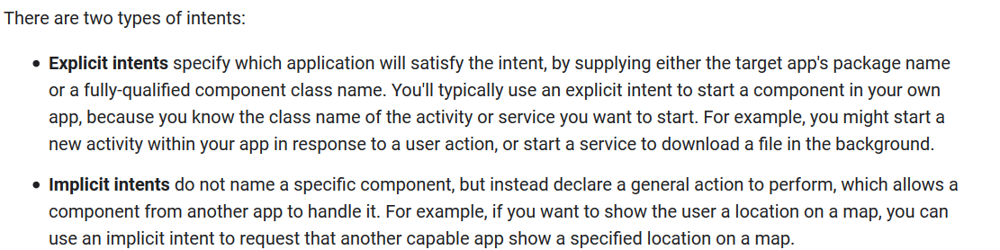

# Intents and intent filters

> Intents filters - https://developer.android.com/guide/components/intents-filters

> Intents common - https://developer.android.com/guide/components/intents-common

> Android intent hijacking - https://attack.mitre.org/techniques/T1416/

**Intents** are used to invoke *activities*, *services* and *send broadcasts* to another app.

Each app can define **intent-filters** for its *activities*, *services*, *broadcast receivers*.

## 	Intent types




> https://developer.android.com/guide/components/intents-filters#Receiving


## Defining intents

`android.intent.action`

`android.intent.extra`

## Invoking through intents

### Explicit

```java
Intent downloadIntent = new Intent(this, DownloadService.class);
downloadIntent.setData(Uri.parse(fileUrl));
startService(downloadIntent);
```

### Implicit

An implicit intent specifies an action that can invoke any app on the device able to perform the action. 


# Broadcasts

https://developer.android.com/guide/components/broadcasts

## Sending a broadcast

`sendBroadcast`

`sendOrderedBroadcast`

`LocalBroadcastManager.sendBroadcast`

## Local broadcast

-  You know that the data you are broadcasting won't leave your app, so don't need to worry about leaking private data. 
-  It is not possible for other applications to send these broadcasts to your app, so you don't need to worry about having security holes they can exploit. 
-  It is more efficient than sending a global broadcast through the system. 

# Services


# 	Activities

Allowing an App to invoke you activities - https://developer.android.com/training/basics/intents/filters.html

Setup an activity's intent-filter to receive simple data from other Apps - https://developer.android.com/training/sharing/receive.html

# Content Provider

https://developer.android.com/reference/android/content/ContentProvider.html

`extends ContentProvider`

# Media Store

https://developer.android.com/reference/android/provider/MediaStore.html

`MediaStore`

# External Storage

```
https://developer.android.com/training/articles/security-tips#ExternalStorage
```

# SD card


**So, any app with READ|WRITE_EXTERNAL_STORAGE can tamper with data stored on the sd card. Data in shared storage can be accessed by any app without special permissions.**

# Shared storage

https://developer.android.com/training/data-storage

https://developer.android.com/training/data-storage/shared/documents-files

# References

> Security tips - https://developer.android.com/training/articles/security-tips

> Interacting with Other Apps - https://developer.android.com/training/basics/intents/index.html

> Sharing simple data - https://developer.android.com/training/sharing/index.html

> Intent spoofing - http://blog.palominolabs.com/2013/05/13/android-security/index.html

https://www.usenix.org/system/files/conference/usenixsecurity15/sec15-paper-ren-chuangang.pdf

> Allow install on sd card - https://developer.android.com/guide/topics/data/install-location